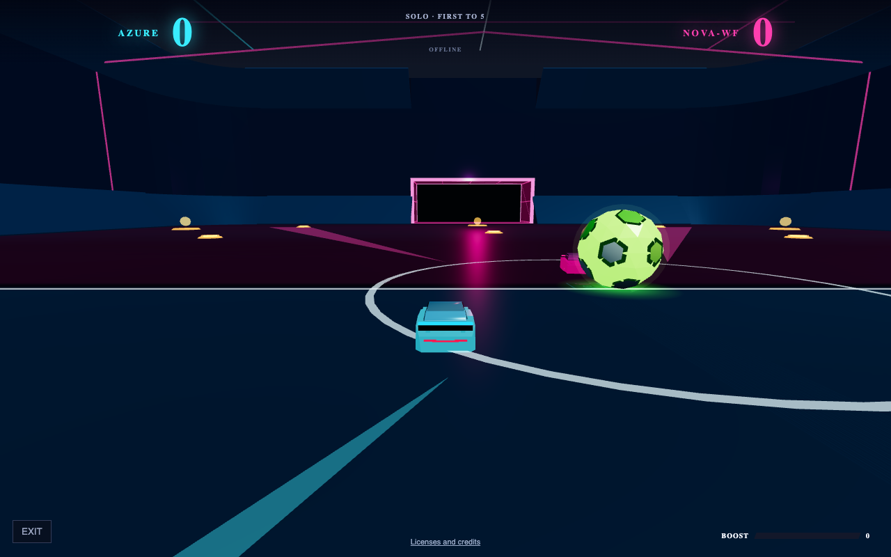

# Neon Rocket 3D

A browser-based car-soccer experiment with a neon Three.js arena, WebAssembly vehicle physics, rule-based opponents, and server-authoritative private 1v1 rooms. The interface is in French; this documentation describes the implementation in English.

The project explores the boundary between simulation, rendering, networking, and reproducible AI evaluation. It is a prototype, not an official Rocket League client or a production multiplayer service.



## Play now

**[Launch the solo demo](https://airope.github.io/neon-rocket/)** — three opponents, entirely in your browser. GitHub Pages does **not** host the multiplayer server. For private rooms and live spectator mode, use the self-hosted setup below.

[](https://github.com/airope/neon-rocket/actions/workflows/verify.yml)

## Play locally

From the repository root:

```sh
node --version
node --input-type=module -e "import { DatabaseSync } from 'node:sqlite'; const db = new DatabaseSync(':memory:'); console.log(db.prepare('SELECT 1 AS ok').get()); db.close();"
npm ci
npm test
npm start
```

Open **http://localhost:3444**. Keep the server running while loading assets or playing online. There is no frontend build step.

- **Runtime:** Node.js **24 or later**, with built-in `node:sqlite`. Local browser and physics validation used Node.js 26.5.0 / npm 11.17.0; CI targets Node.js 24. The probe above checks that SQLite is available in your installation.
- **Database:** no separate SQLite server, CLI, or npm SQLite binding is needed. The process needs permission to create/write `data/nova-stats.sqlite` and its SQLite sidecar files. Startup opens the database even if you only intend to play solo.
- **Browser:** requires WebGL and WebAssembly. Keyboard, standard gamepad, and touch input paths exist; device/browser compatibility still needs hands-on verification.
- **Native assets:** the supplied `native/rocketsim/dist/` files and `shared/rocketsim-wasm-bundled.js` are runtime assets, not disposable build output. `npm ci` does not rebuild them. Native rebuild provenance is a separate release gate; see [verification](docs/VERIFICATION.md).

Optional server configuration (POSIX shell):

```sh
PORT=3445 NOVA_STATS_DB=./data/development.sqlite npm start
```

`PORT` defaults to `3444`; `HOST` defaults to `127.0.0.1` (loopback only). `NOVA_STATS_DB` defaults to `data/nova-stats.sqlite`. Public multiplayer requires explicit host/origin configuration and HTTPS/WSS; see [self-hosting](docs/SELF_HOSTING.md).

## Modes and engines

| Mode | Simulation location | Engine / implementation |
| --- | --- | --- |
| Solo: NOVA 1, NOVA 2, or NOVA-WF | Browser | Native RocketSim compiled to WebAssembly, via `shared/rocketsim-local-simulation.js` |
| Private 1v1, six-character room code | Node server; clients send inputs and render snapshots | RocketSim WebAssembly, via `server/rocketsim-room.js` |
| Observe NOVA 1 vs NOVA 2 | Shared server duel; local fallback when unavailable | Rapier, via `shared/simulation-v3.js` |
| Historical headless AI evaluation / parameter search | Node scripts | Cannon-es, via `shared/simulation.js` |

These are **different physics and controller paths**, not interchangeable benchmarks. All three normal solo selections use RocketSim. Developer-only ball, camera, and match preview query parameters retain a Rapier fixture path.

Solo simulation does not depend on successful multiplayer transport once its assets are loaded, but the page still attempts a Socket.IO connection. This is not an installable offline app or a promise that an uncached page can load without a server.

### What “AI” means here

NOVA controllers are hand-written rules, not trained neural networks or reinforcement-learning policies. On the RocketSim solo path:

- **NOVA 1:** direct approach to the ball.
- **NOVA 2:** tactical pursuit, threat handling, and interception.
- **NOVA-WF:** shadow defense, boost routing, and predictive attack.

`shared/rocketsim-nova.js` implements those variants. The legacy controller/evaluation path also includes a parameterized state machine and evolutionary parameter search. Its results do not establish the strength of the RocketSim controllers; no learned policy weights are loaded by the playable app.

## Controls

| Input | Action |
| --- | --- |
| WASD / arrow keys | Drive and steer; pitch/yaw while airborne |
| Space | Jump / second jump |
| Shift | Boost |
| Q / E | Air roll |
| C | Powerslide |
| Gamepad left stick / triggers | Steering / throttle and brake |
| Gamepad primary / secondary / third face button | Jump / boost / powerslide |
| On-screen touch controls | Steering, throttle, brake, jump, boost, drift |

The main game uses an automatic chase camera, not the old mouse-orbit camera. Gamepad mappings assume the standard browser layout; physical controllers and mobile devices are not certified by the unit tests.

## What this project implements

- A procedural neon arena and vehicle presentation, chase camera, HUD, boost effects, and keyboard/gamepad/touch input paths in Three.js.
- A C++/WebAssembly bridge that connects **upstream RocketSim** to a custom arena mesh and JavaScript match lifecycle; RocketSim itself is not an engine authored by this project.
- Local rule-based opponents, boost pickups, countdowns, scoring, and rematches.
- Authoritative private rooms: clients send controls; the server simulates and broadcasts snapshots, with client interpolation for rendering.
- Separate experiments in Rapier physics and deterministic Cannon-based AI evaluation, kept explicit rather than presented as equivalent benchmarks.

## Engineering map

- `public/`: Three.js presentation, French UI, input handling, interpolation, and native-engine diagnostic pages.
- `shared/`: match contracts, arena geometry, RocketSim adapters/controllers, Rapier simulation, and historical Cannon simulation.
- `server.js` / `server/`: Express assets and APIs, Socket.IO rooms, fixed-step scheduling, AI statistics, and evaluation tooling.
- `native/rocketsim/`: C++ bridge and supplied WebAssembly runtime.
- `test/`: Node tests for physics, controls, room state, network smoothing, statistics, and evaluator behavior. Some browser-facing checks inspect source contracts rather than executing a browser.

The initial baseline had 176 passing tests; additional release regressions cover network boundaries, native scoring, metrics provenance and static packaging. Real Chrome QA exercises all three solo choices and two-client multiplayer. See [VERIFICATION.md](docs/VERIFICATION.md) for exact evidence boundaries and remaining limitations, including physical input devices and live contact statistics.

## Documentation

- [Architecture and engine boundaries](docs/ARCHITECTURE.md)
- [Self-hosting and server limits](docs/SELF_HOSTING.md)
- [Release scope and limitations](docs/RELEASE_SCOPE.md)
- [Privacy and data lifecycle](docs/PRIVACY.md)
- [Verification and release checklist](docs/VERIFICATION.md)
- [Contributing](CONTRIBUTING.md)
- [Security](SECURITY.md)

Project-authored code is [MIT licensed](LICENSE). RocketSim, Bullet, compiler runtime and browser libraries retain their respective terms: see [third-party notices](THIRD_PARTY_NOTICES.md). Complete legal texts are included in the static export.
