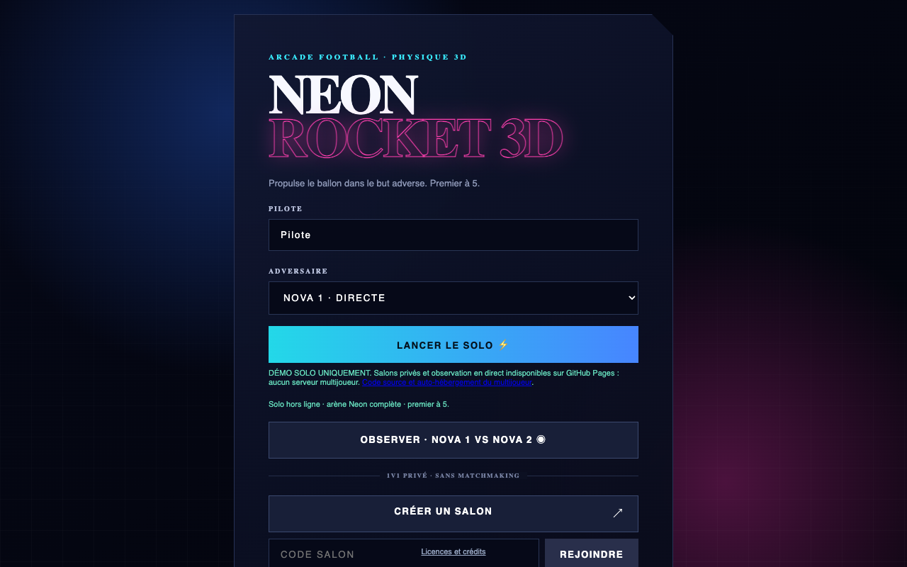

# Neon Rocket 3D

**Boost. Jump. Chase the ball. First to five.**

Browser car-soccer in a neon arena: Three.js visuals, RocketSim vehicle physics compiled to WebAssembly, three rule-based opponents, and self-hosted private 1v1 rooms.

**[Play the solo demo →](https://airope.github.io/neon-rocket/)** · **[Browse the source](https://github.com/airope/neon-rocket)** · **[Host a private match](docs/SELF_HOSTING.md)**

[](https://github.com/airope/neon-rocket/actions/workflows/verify.yml) [](https://github.com/airope/neon-rocket/releases/tag/v2.0.0)


*Actual Chrome capture from the public demo — solo against NOVA-WF, running the native RocketSim WebAssembly engine. Not an online match or a rendered mockup.*

> **The public demo is solo-only.** GitHub Pages does not run the multiplayer server; private rooms and live spectating require self-hosting. The game interface is in French. This is an independent prototype, not an official Rocket League client or a production multiplayer service.

## Inside the arena

- **Drive, boost and fly:** jumps, air control, powerslides, boost pickups, scoring and rematches, with an automatic chase camera.
- **Pick your opponent:** NOVA 1 pursues directly; NOVA 2 adds tactical interception; NOVA-WF adds shadow defense, boost routing and predictive attack. These are hand-written controllers, **not trained neural networks**.
- **Challenge a friend:** six-character private room codes, server-authoritative simulation and interpolated client rendering. No public matchmaking.
- **Explore the engineering:** a C++/WASM bridge, custom arena mesh, fixed-step networking and separate physics/evaluation experiments. RocketSim is an upstream engine, not an engine authored by this project.

## Gallery · choose your opponent



*Actual Chrome capture of the GitHub Pages lobby. Server-only controls are disabled; the notice explains why.* Both gallery images are real, unaltered page captures. See [capture provenance](docs/images/README.md).

## Run it yourself

Use **Node.js 24+** with built-in `node:sqlite`, and a browser supporting WebGL and WebAssembly.

```sh
git clone https://github.com/airope/neon-rocket.git
cd neon-rocket
npm ci
npm test
npm run verify:native
npm start
```

Open **http://localhost:3444**. There is no frontend build step. Keep the server running while loading assets or playing online.

- The server creates `data/nova-stats.sqlite` on startup, including for solo use. It needs write permission; no separate database service is required.
- Keep the supplied `native/rocketsim/dist/` and `shared/rocketsim-wasm-bundled.js` runtime assets. `npm ci` does not rebuild them.
- Defaults: `HOST=127.0.0.1`, `PORT=3444`. Override the database with `NOVA_STATS_DB`. For remote multiplayer, configure host/origin restrictions and HTTPS/WSS using the [self-hosting guide](docs/SELF_HOSTING.md).
- For a solo-only static export, run `npm run build:demo`; see [static-demo verification](docs/VERIFICATION.md#reproduce) before deploying.

## Three engines, distinct jobs

| Engine | Where it is used | Why it is here |
| --- | --- | --- |
| **RocketSim → WebAssembly** | All three normal solo opponents in the browser; private 1v1 on the Node server | Native vehicle physics integrated through a project-specific C++/JS bridge |
| **Rapier** | NOVA 1 vs NOVA 2 spectator duel, with a local fallback; developer preview fixtures | A separate simulation and controller path |
| **Cannon-es** | Historical headless AI evaluation and parameter-search scripts | Reproducible controller experiments, not the playable native simulation |

These paths are **not interchangeable benchmarks**. Historical evaluation scores do not establish the strength of the current solo opponents. See [architecture and engine boundaries](docs/ARCHITECTURE.md).

## Controls

| Input | Action |
| --- | --- |
| WASD / arrow keys | Drive and steer; pitch/yaw in the air |
| Space | Jump / second jump |
| Shift | Boost |
| Q / E | Air roll |
| C | Powerslide |
| Standard gamepad | Left stick / triggers to drive; primary / secondary / third face button for jump / boost / powerslide |
| On-screen touch controls | Steering, throttle, brake, jump, boost and drift |

Keyboard gameplay has real-browser evidence. Physical gamepads, mobile devices and browser/OS combinations remain unverified; implemented input mappings are not hardware certification.

## Verification, not promises

Recorded Chrome QA passed **42 checks on the public solo demo** and **54 checks on the local server build**, including two-client private-room play. Those runs establish behavior for the tested snapshot, not a hosted multiplayer service or every future revision. The [verification report](docs/VERIFICATION.md) links CI evidence and reproducible commands.

Native scoring is covered by real-WASM integration fixtures; Rapier preview screenshots are not native scoring proof. **Live contact-derived AI statistics are not certified.** See the [full limitations](docs/VERIFICATION.md#important-limits) and [release scope](docs/RELEASE_SCOPE.md).

## Read further

[Architecture](docs/ARCHITECTURE.md) · [Self-hosting](docs/SELF_HOSTING.md) · [Verification](docs/VERIFICATION.md) · [Release scope](docs/RELEASE_SCOPE.md) · [Privacy](docs/PRIVACY.md) · [Security](SECURITY.md) · [Contributing](CONTRIBUTING.md)

### Licensing

The current code is available under the **[MIT license](LICENSE)**, including the v2.0.0 release. RocketSim, Bullet, compiler runtime and browser libraries retain their respective terms: see [third-party notices](THIRD_PARTY_NOTICES.md).
